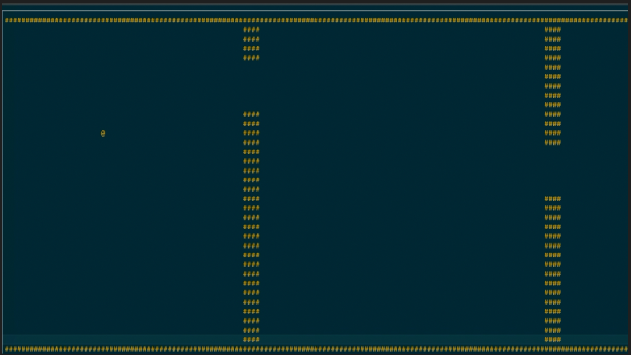

## Flappy Bird on Console

Some coding exercises when learning golang.

Flappy bird game again, but this time in Go.

* [**gocui**](https://github.com/jroimartin/gocui) was used for command line interfacing

    ```bash
    go get github.com/jroimartin/gocui
    go run flappy.go
    ```

### Keyboard Shortcuts
- **space**: up the bird
- **tab**: Exit


